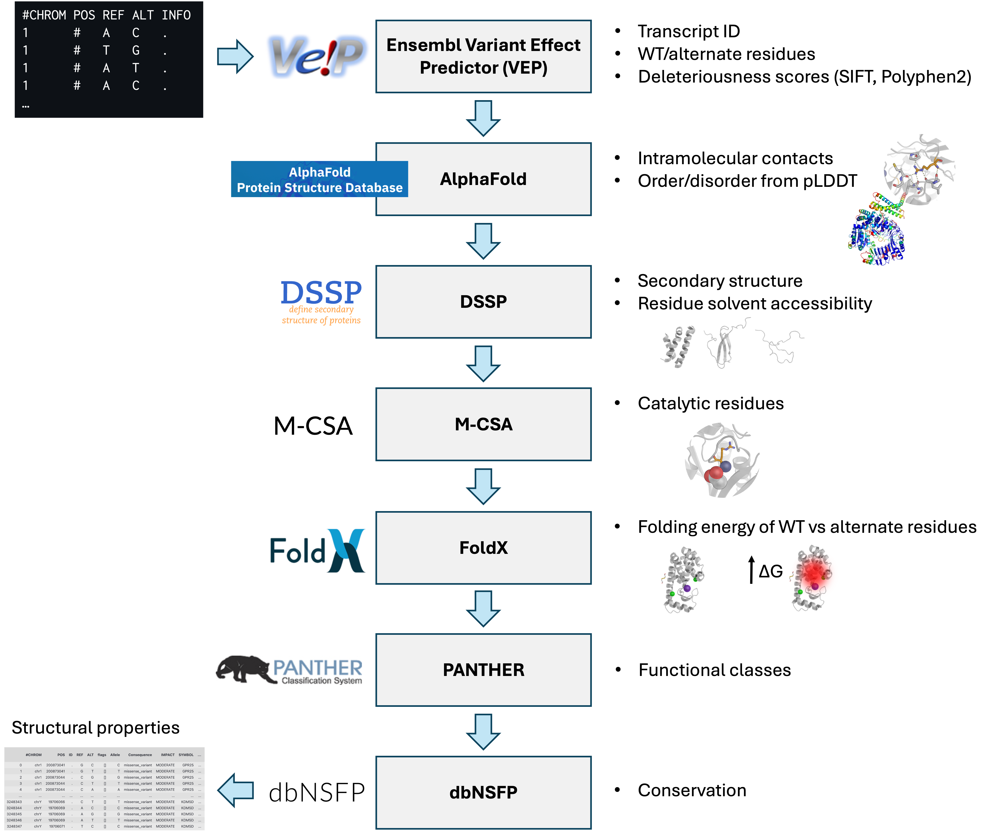
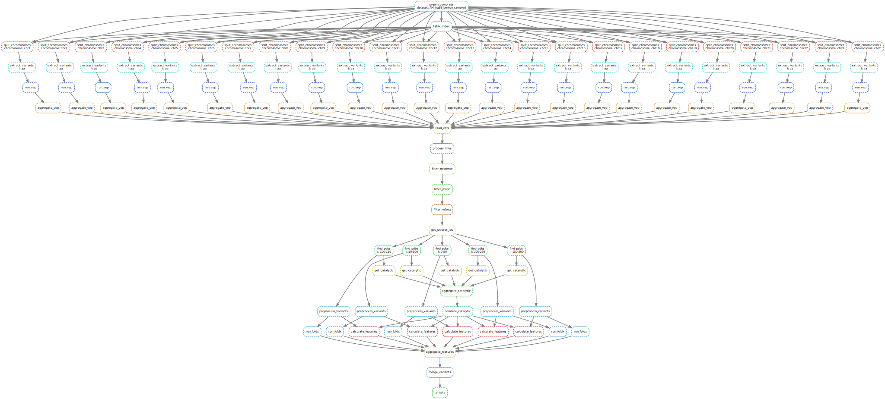

# VarLand

Pipeline for the annotation of missense SNPs using structural and evolutionary features. Implemented with Snakemake.

<p align="center">
   
</p>

</br>



</br>

# Requirements

- Linux
- Conda/Miniconda
- Apptainer or Singularity. This pipeline was tested with [Singularity version 3.9.7](https://docs.sylabs.io/guides/3.9/user-guide/quick_start.html).

# Installation

1. Clone this repository:
   ```bash
   git clone https://github.com/guzmanfj/VarLand_test.git
   ```

2. Navigate to the project directory, download, and extract the resources and data archives:
   ```bash
   cd VarLand_test
   wget resources.tar.gz        # Contains AlphaFold models, VEP cache, PANTHER annotations, and UniProt ID mapping
   tar -xvzf resources.tar.gz
   rm resources.tar.gz
   wget data.tar.gz             # Contains input VCF files used in the paper (see below)
   tar -xvzf data.tar.gz
   rm data.tar.gz
   ```

  The `data` directory should now contain the following files:
  - `AlphaMissense_hg38_benign.vcf` : Benign variants from AlphaMissense (5% most benign)
  - `AlphaMissense_hg38_pathogenic.vcf` : Pathogenic variants from AlphaMissense (5% most pathogenic)
  - `clinvar_20230527.vcf` : ClinVar variants
  - `gnomad.exomes.r2.1.1.sites.liftover_grch38_AFhigherthan0.05.vcf` : Common variants from gnomAD (AF > 0.05)
  - `AM_hg38_benign_sampled.vcf` : Sample of 240 benign variants from AlphaMissense

3. Download the dbNSFP database. Go to the legacy dbNSFP website (https://sites.google.com/site/jpopgen/dbNSFP) and download dbNSFP4.9a (dbNSFP4.9a.zip) into the `resources/dbnsfp` directory. Unzip the file.

4. Download FoldX. Register for an academic license at https://foldxsuite.crg.eu/academic-license-info and download `foldx5Linux64.zip` into the `resources/foldx` directory. Unzip the file.

5. Install Miniconda if you haven't already. See installation instructions at https://www.anaconda.com/docs/getting-started/miniconda/main

6. Create and activate the Conda environment:
   ```bash
   conda env create --file ./environment.yml --prefix ./env
   conda activate ./env
   ```

7. Install Singularity or Apptainer. This pipeline was tested with [Singularity version 3.9.7](https://docs.sylabs.io/guides/3.9/user-guide/quick_start.html).

# Usage

## 1. Configure Snakemake profile

### a) SLURM

The profile located in `profile/slurm/config.v8+.yaml` is set up to use SLURM as the job scheduler and Apptainer for containerization. If you want to use this profile, you need to modify the following fields:

- `slurm_account` : Set this to your SLURM account name. You can find this information by running the command `sacctmgr show user $USER` on your SLURM login node, under the column `Def Acct` (or something similar).

- `apptainer-args` : Point this to the directory where you have the VEP cache. This is the full path to the `resources/vep_data` directory you extracted earlier.

- The rest of the fields you can leave as they are, or modify according to the resources that you have available.

### b) Local execution

The profile located in `profile/local/config.v8+.yaml` is set up to use local execution without a job scheduler. Modify the fields to adjust to your local resources.

## 2. Set up `config.yml` file

Set up the `config/config.yml` file according to your paths and preferences.

## 3. Annotate VCF file

### a) SLURM

This is an example of how to run the pipeline using the SLURM profile, on a login node:

```bash
# You have to be in the directory where you cloned the repository
screen   # Recommended to avoid losing connection while the pipeline is running
module load singularity/3.9.7
conda activate ./env
snakemake --workflow-profile ./profile/slurm
```

### b) Local execution

This is an example of how to run the pipeline using the local profile:

```bash
# You have to be in the directory where you cloned the repository
conda activate ./env
snakemake --workflow-profile ./profile/local
```

### Results

The file called `{dataset}_annotations.pkl` directly inside of the output directory (`results_dir` in the `config.yml` file) contains a Pandas DataFrame with the annotations for each variant in the input VCF file. You can load it in Python using:

```python
import pandas as pd

# Use the name of your dataset instead of {dataset}, e.g. "variants" if you used the default configuration
annotations = pd.read_pickle("results/variants_annotations.pkl")
```

## Troubleshooting

### Error with `.docker/config.json`

If you have Docker installed on your machine, Singularity might try to access the Docker credentials file located at `~/.docker/config.json` and fail if it does not have the proper permissions. The error message looks something like this:

```
getting username and password: 1 error occurred:
	* error reading JSON file "/home/username/.docker/config.json": open /home/username/.docker/config.json: permission denied
```

To avoid this, you can do one of the following:

a) Change the permissions of the `.docker` directory and its contents so that your user has access to it:

```bash
sudo chown -R "$USER":"$(id -gn)" ~/.docker
chmod 700 ~/.docker
[ -f ~/.docker/config.json ] && chmod 600 ~/.docker/config.json
```

b) If you're in a multi-user system and you don't want to change the permissions of the `.docker` directory, you can bypass the Docker credentials file by pointing the Docker config to an empty, readable directory. For example:

```bash
mkdir -p ~/.docker_empty
export DOCKER_CONFIG="$HOME/.docker-empty"
```

Then run Snakemake in the same terminal session.